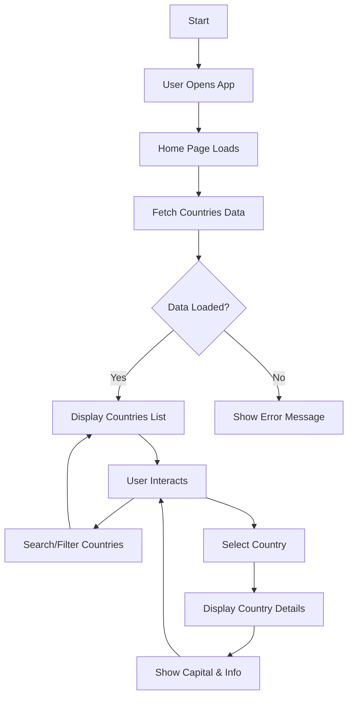

# World Capital Explorer - README


## 📌 Overview
World Capital Explorer is a React-based web application that displays the capitals of countries around the world. This project provides an interactive way to explore country capitals with a clean, user-friendly interface.

## 🚀 Features
- View comprehensive list of countries and their capitals
- Search/filter functionality to find specific countries
- Responsive design that works on all devices
- Built with React, TypeScript, and Redux for state management
- Modern UI with clean animations and transitions

## 🛠️ Technologies Used
- **Frontend**: React.js, TypeScript
- **State Management**: Redux
- **Styling**: CSS Modules
- **Build Tool**: Create React App
- **Testing**: Jest (with setupTests.ts)

## 📂 Project Structure
```
world_capital_explorer/
├── public/                 # Static files
│   ├── favicon.ico
│   ├── index.html
│   ├── logo192.png
│   ├── logo512.png
│   ├── manifest.json
│   └── robots.txt
├── src/
│   ├── pages/              # React page components
│   │   ├── Country.tsx     # Individual country view
│   │   └── Home.tsx        # Main listing page
│   ├── redux/              # Redux configuration
│   │   ├── actions/        # Redux actions
│   │   ├── reducers/       # Redux reducers
│   │   └── store.ts        # Redux store
│   ├── App.css             # Main styles
│   ├── App.tsx             # Root component
│   ├── index.tsx           # Entry point
│   ├── Routes.tsx          # Application routes
│   ├── types.ts            # TypeScript type definitions
│   └── serviceWorker.ts    # Service worker config
├── package.json            # Project dependencies
├── package-lock.json       # Exact dependency tree
├── tsconfig.json           # TypeScript config
└── yarn.lock               # Yarn dependency locks
```

## 🏁 Getting Started

### Prerequisites
- Node.js (v14 or higher recommended)
- npm or yarn

### Installation
1. Clone the repository:
   ```bash
   git clone https://github.com/your-username/world_capital_explorer.git
   ```
2. Navigate to the project directory:
   ```bash
   cd world_capital_explorer
   ```
3. Install dependencies:
   ```bash
   npm install
   # or
   yarn install
   ```

### Running the Application
```bash
npm start
# or
yarn start
```
This will start the development server at `http://localhost:3000`

### Building for Production
```bash
npm run build
# or
yarn build
```

## 🙏 Acknowledgments
- Country data sourced from [REST Countries API](https://restcountries.com/)
- React community for awesome tools and libraries

---


## 🔄 Application Flow


